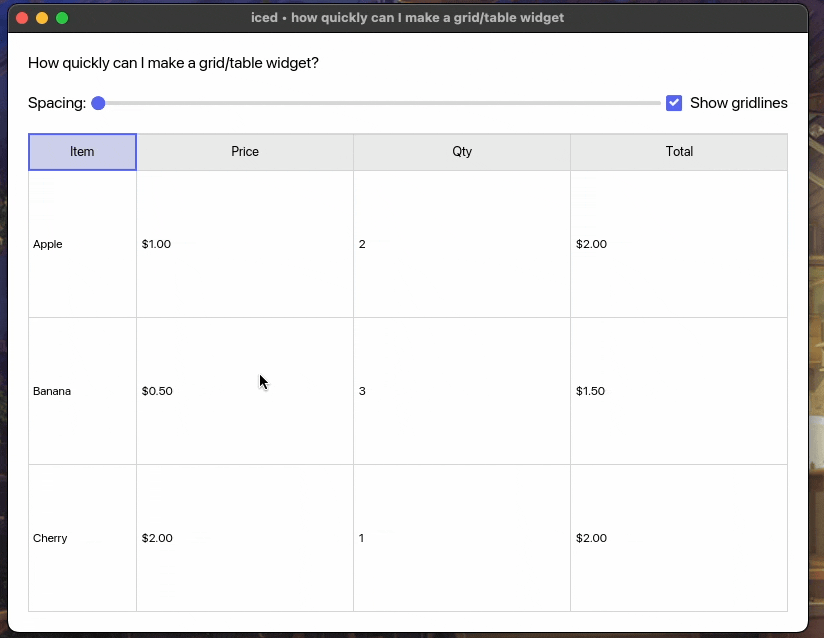

<div align="center">

# tabular

[](https://github.com/iced-rs/iced)

A table widget for `iced` which is generic over the data type in cells and cell references. Create spreadsheet-like interfaces with ease!

*Results may vary. No pivots included. Side effects may include sorting headaches, cell formatting debates, and the occasional formula that looks right but isn't. Creating a formula engine is left as an exercise for the obsessed reader - this table is just a table!*



</div>

## Usage

The widget is generic over the data type in cells and supports custom cell referencing systems. A default implementation for `Vec<Vec<T>>` is provided.

Check out the `examples` directory for a simple example or run it via:

```
$ cargo run --example simple
```

## License

MIT
